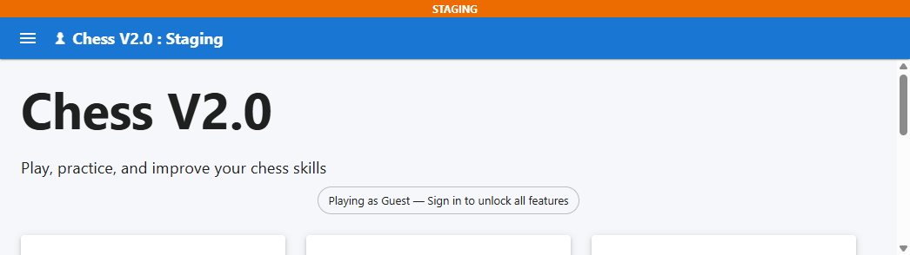
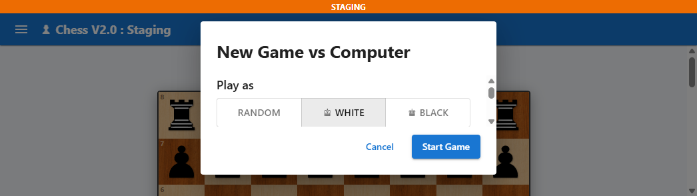
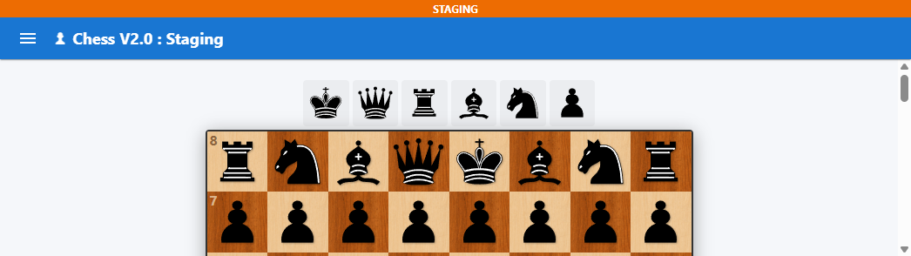

# ChessV2

<p>
	
	
	
	
	
	
</p>

<p><strong>Play against the computer, study custom positions, analyze with Stockfish, and queue live online matches from one full-stack TypeScript chess app.</strong></p>

ChessV2 combines a React + Vite frontend with an Express + MongoDB + Socket.IO backend. It covers both player-facing features and production-facing concerns, including realtime matchmaking, hardened auth sessions, integration tests, staged deploys, smoke checks, rollback, and monitoring.

## At A Glance

- one app for VS Computer, Practice, Analysis, Replay, and live Online Play
- guest mode plus authenticated profile, settings, stats, activity, saved games, history, and social controls
- realtime multiplayer with matchmaking, clocks, reconnect/resume, draw offers, rematches, and disconnect handling
- operational tooling with CI, integration tests, deploy smoke checks, rollback, structured logs, health checks, and optional Sentry

## Quick Links

- [Overview](#overview)
- [Feature Set](#feature-set)
- [Tech Stack](#tech-stack)
- [Getting Started](#getting-started)
- [Available Commands](#available-commands)
- [Testing And Quality](#testing-and-quality)
- [Deployment And Environments](#deployment-and-environments)
- [Monitoring And Operations](#monitoring-and-operations)
- [Additional Docs](#additional-docs)

## Screenshots

| Home | VS Computer | Analysis |
| --- | --- | --- |
|  |  |  |

## Overview

This repository supports multiple chess workflows in one application:

- play against the computer with selectable color and difficulty
- play online in real time with matchmaking, clocks, reconnect, draw offers, and rematches
- practice on a free board with FEN loading and position editing
- analyze positions with Stockfish and apply the suggested move
- save games, browse history, and replay completed games move by move
- manage account settings, profile data, privacy rules, and social connections

The project is structured as a monorepo-style workspace:

- `src/` contains the client application
- `server/` contains the API, persistence, realtime logic, and operational tooling
- `shared/` contains shared types/constants used across client and server

## Feature Set

| Area | What is implemented |
| --- | --- |
| Gameplay | VS Computer, Online Play, Practice board, Next Best Move analysis |
| Online multiplayer | Matchmaking, time controls, reconnect/resume, disconnect abandonment countdown, draw offers, rematches |
| Persistence | Saved games, history filters, replay page, saved analysis positions |
| Accounts | Register, login, guest mode, protected routes, profile and account summary |
| Social | User search, friend requests, blocking, challenge/privacy policies |
| Customization | Board themes, move highlighting, sounds, animation, orientation, move confirmation, auto-promotion, analysis/practice preferences |
| Operations | Health endpoint, structured request logging, optional Sentry capture, staging/production deploy workflows, smoke checks, rollback path, scheduled health monitoring |
| Quality | ESLint, TypeScript builds, backend integration tests with in-memory MongoDB + real HTTP/Socket.IO flows |

### Gameplay Modes

#### VS Computer

- choose white, black, or random
- choose difficulty (`easy`, `medium`, `hard`)
- play on the full board UI with move list, captured pieces, zoom, and game-end dialog
- save games manually and auto-save completed games for authenticated users

#### Online Play

- join matchmaking with time-control and color preferences
- receive live board state, clocks, and opponent presence through Socket.IO
- reconnect to active games and resume the room automatically
- handle draw offers, resignation, rematches, and disconnect-abandonment grace periods

#### Practice

- free board movement for studying positions
- load, edit, reset, and copy FEN positions
- practice sessions can be recorded as activity for signed-in users

#### Analysis

- editable board with validation
- find the next best move through Stockfish-backed analysis
- inspect SAN move, evaluation, search depth, and principal variation
- apply the suggested move and save analysis positions when authenticated

### Account, History, And Social Features

- guest mode for non-authenticated usage
- authenticated settings, saved games, history, profile, and social pages
- recent activity and stats surfaced from backend user-domain records
- friend request handling, blocking, search by username/display name/friend code
- configurable social visibility and challenge policies

## Tech Stack

### Frontend

- React 19
- TypeScript
- Vite 8
- Material UI 9
- Redux Toolkit
- React Router
- Axios
- Socket.IO client
- `chess.js`

### Backend

- Node.js
- Express 5
- TypeScript (ESM)
- MongoDB + Mongoose
- Socket.IO
- JWT auth with refresh-token rotation hardening
- Zod request validation
- Helmet and rate limiting
- Cookie-based auth helpers

### Infrastructure And Operations

- GitHub Actions for CI, staging deploy, production deploy, and health monitoring
- PM2 for process management
- nginx for reverse proxy / edge serving
- optional Sentry backend error tracking
- Stockfish engine integration for analysis endpoints

## Repository Layout

```text
.
|- src/                     Frontend application (React, routes, pages, features)
|- server/                  Backend API, models, services, sockets, tests
|- shared/                  Shared constants and TypeScript types
|- docs/                    Deployment and environment guides
|- public/                  Static frontend assets
|- COMPONENTS.md            Older component notes
|- package.json             Frontend/root scripts
`- README.md                Project guide
```

### Frontend Highlights

- `src/routes/index.tsx` wires the main application routes
- `src/components/common/AppLayout.tsx` provides responsive navigation and auth-aware menus
- `src/features/game/` contains VS Computer and Practice flows
- `src/features/analysis/` contains editable-board analysis tools
- `src/pages/OnlinePlayPage.tsx` drives the live multiplayer experience
- `src/pages/SettingsPage.tsx` exposes user settings, stats, and recent activity

### Backend Highlights

- `server/src/app.ts` sets up middleware, route groups, and `/api/health`
- `server/src/server.ts` boots MongoDB, Socket.IO, Stockfish, monitoring, and shutdown hooks
- `server/src/services/` contains auth, game, matchmaking, and user-domain business logic
- `server/src/sockets/` handles online-game realtime behavior
- `server/tests/integration/` covers auth, history, and realtime flows end to end

## Backend Surface

The API is organized by route group:

- `/api/auth` - register, login, refresh, logout, me
- `/api/games` - game creation, session recovery, save/update flows
- `/api/history` - completed game history and replay data
- `/api/settings` - user preference storage
- `/api/matchmaking` - online queue and online game support
- `/api/engine` - analysis endpoints backed by Stockfish
- `/api/user` - profile, social, saved positions, activity, and summary data
- `/api/guest` - guest session helpers
- `/api/maintenance` - maintenance/admin-oriented endpoints
- `/api/health` - runtime health, DB state, release, response time, request id

## Getting Started

### Prerequisites

- Node.js 22.19+ recommended
- npm 11+ recommended
- a MongoDB connection string
- a Stockfish binary if you want analysis features locally

Notes:

- local development can still boot if Stockfish is unavailable, but engine analysis endpoints will fail until `STOCKFISH_PATH` is fixed
- backend installs in CI and deploy workflows are pinned to npm 11 because the current server lockfile relies on npm 11 behavior

### Install Dependencies

From the repository root:

```bash
npm install
npm --prefix server install
```

### Run Locally

Start the client and server together:

```bash
npm run dev
```

Default local URLs:

- frontend: `http://localhost:5173`
- backend API: `http://localhost:3001`

In local development, leave `VITE_API_URL` empty and Vite will proxy `/api` and `/socket.io` traffic to the backend.

## Environment Files

Create runtime env files from the tracked templates:

- `.env.example` -> `.env`
- `.env.example` -> `.env.staging` if you want a local staging-style frontend build
- `.env.example` -> `.env.production` for local production-like frontend builds
- `server/.env.example` -> `server/.env`
- `server/.env.example` -> `server/.env.staging`
- `server/.env.example` -> `server/.env.production`

Do not commit real `.env` files.

### Frontend Env

The client template currently uses:

- `VITE_API_URL` - leave empty in local dev, set deployed API URL for hosted builds
- `VITE_APP_LABEL` - optional override for the environment label shown in the UI

### Backend Env

The server template currently uses:

- `APP_ENV` - `development`, `staging`, or `production`
- `NODE_ENV` - runtime mode
- `PORT`
- `MONGODB_URI`
- `JWT_SECRET`
- `JWT_REFRESH_SECRET`
- `JWT_EXPIRES_IN`
- `JWT_REFRESH_EXPIRES_IN`
- `CLIENT_URL`
- `APP_RELEASE` - usually injected by deploy workflows
- `SLOW_REQUEST_THRESHOLD_MS`
- `SENTRY_DSN`
- `SENTRY_TRACES_SAMPLE_RATE`
- `STOCKFISH_PATH`

Environment selection rules:

- backend: `APP_ENV=staging` loads `server/.env.staging`, `APP_ENV=production` loads `server/.env.production`, otherwise `server/.env`
- frontend: `vite --mode staging` loads `.env.staging`, `vite build --mode production` loads `.env.production`

## Available Commands

### Root Commands

| Command | Purpose |
| --- | --- |
| `npm run dev` | Start frontend and backend together |
| `npm run dev:client` | Start Vite only |
| `npm run dev:server` | Start backend only via `server/` |
| `npm run dev:staging` | Start frontend in staging mode |
| `npm run build` | Type-check and build the client |
| `npm run build:staging` | Type-check and build the client in staging mode |
| `npm run build:prod` | Type-check and build the client in production mode |
| `npm run lint` | Run frontend/root linting |
| `npm run preview` | Preview the built frontend |

### Server Commands

Run these from `server/` or via `npm --prefix server ...`:

| Command | Purpose |
| --- | --- |
| `npm run dev` | Start backend in watch mode |
| `npm run dev:staging` | Start backend in staging config with dev watch mode |
| `npm run build` | Compile the backend |
| `npm run start` | Start compiled backend |
| `npm run start:staging` | Start compiled backend in staging mode |
| `npm run start:prod` | Start compiled backend in production mode |
| `npm run lint` | Lint backend source |
| `npm run test` | Run backend tests |
| `npm run test:integration` | Run backend integration tests |
| `npm run backfill:user-domains` | Run the compiled one-time user-domain backfill migration |
| `npm run backfill:user-domains:dev` | Run the backfill migration through `tsx` |

## Testing And Quality

Recommended checks:

```bash
npm run lint
npm run build:staging
npm --prefix server run lint
npm --prefix server run build
npm --prefix server run test:integration
```

### What The Integration Suite Covers

- auth flows: health, register, login, refresh, logout, rotated-token reuse detection
- history flows: authenticated listing and detail retrieval
- realtime flows: matchmaking, move acceptance, disconnect/reconnect, resumable online sessions

Notes:

- integration tests use `mongodb-memory-server`
- the first test run on a machine may download a MongoDB binary, which can take a while

## Deployment And Environments

Branch mapping:

- `staging` -> staging / UAT deploy path
- `main` -> production deploy path

GitHub Actions workflows:

- `.github/workflows/ci.yml` - pull request CI
- `.github/workflows/deploy-staging.yml` - deploy on pushes to `staging`
- `.github/workflows/deploy-production.yml` - deploy on pushes to `main`
- `.github/workflows/monitor-health.yml` - scheduled health and latency checks

### Deploy Workflow Behavior

Current deploy workflows do all of the following:

- validate required secrets and environment assumptions
- run client and server lint/build jobs before deploy
- run backend integration tests in the server job
- SSH to the target server
- install dependencies and build the client/server
- restart PM2 with updated environment values
- validate nginx and reload it
- run smoke checks against the deployed app
- rollback to the previous remote commit if deploy/restart/smoke checks fail

### Important Rules

- never reuse production secrets in staging
- keep separate databases and JWT secrets per environment
- ensure `server/.env.staging` contains `APP_ENV=staging`
- ensure `server/.env.production` contains `APP_ENV=production`

## Monitoring And Operations

Operational hardening already included in the repo:

- structured backend logs with request ids
- slow-request logging based on `SLOW_REQUEST_THRESHOLD_MS`
- optional Sentry exception capture via `SENTRY_DSN`
- health endpoint at `/api/health`
- deploy-time `APP_RELEASE` injection so the running commit is visible at runtime
- scheduled GitHub Actions health monitor with optional Slack webhook alerts

The `/api/health` response includes:

- environment
- release
- timestamp
- uptime
- response time
- request id
- database connection state and ping result

## Migration Note

The legacy user-domain backfill no longer runs during server startup.

If you are upgrading an older environment that may have users missing profile, settings, stats, or social records, run this once after building the backend:

```bash
cd server
npm run build
npm run backfill:user-domains
```

## Troubleshooting

### `npm ci` fails in `server/`

Use npm 11+ when working in `server/`. Current CI/deploy automation is pinned accordingly.

### Analysis is not working locally

Check `STOCKFISH_PATH`. The app can still boot in development without Stockfish, but engine analysis requests will fail.

### Online features are missing in the UI

Online Play, Profile, Social, Saved Games, and History are auth-only sections. Sign in to unlock them.

### First integration test run is slow

`mongodb-memory-server` may download a MongoDB binary the first time the integration suite runs on a machine.

## Additional Docs

- [docs/env-values-guide.md](docs/env-values-guide.md)
- [docs/deployment-checklist.md](docs/deployment-checklist.md)

If you are onboarding to the codebase, start with those docs plus the route entrypoints in `src/routes/index.tsx` and `server/src/app.ts`.
